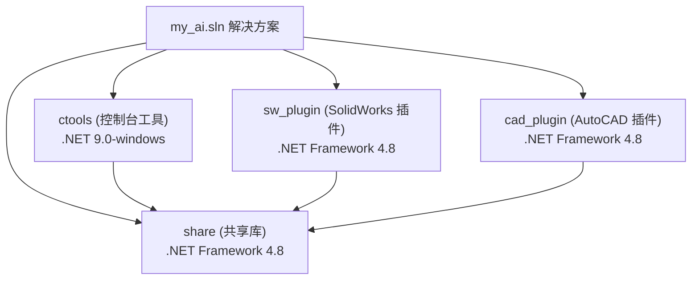
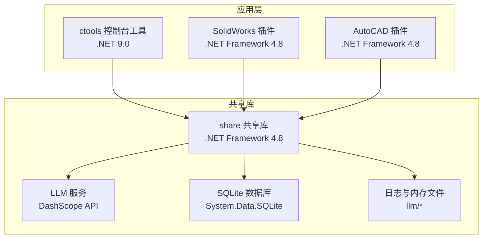
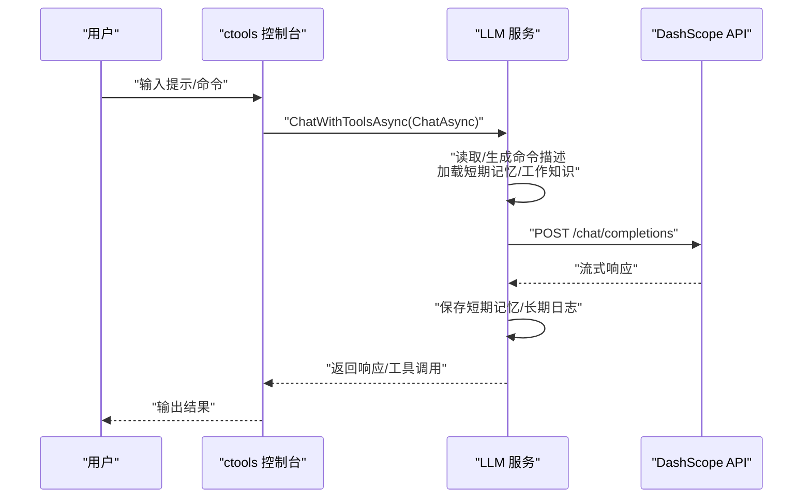
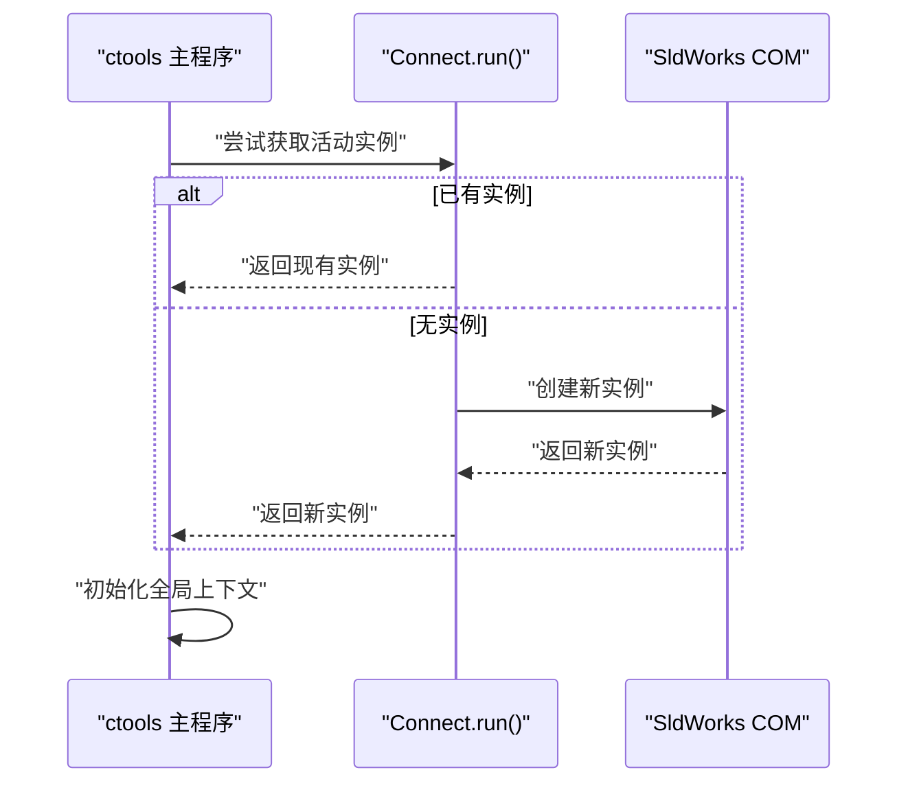
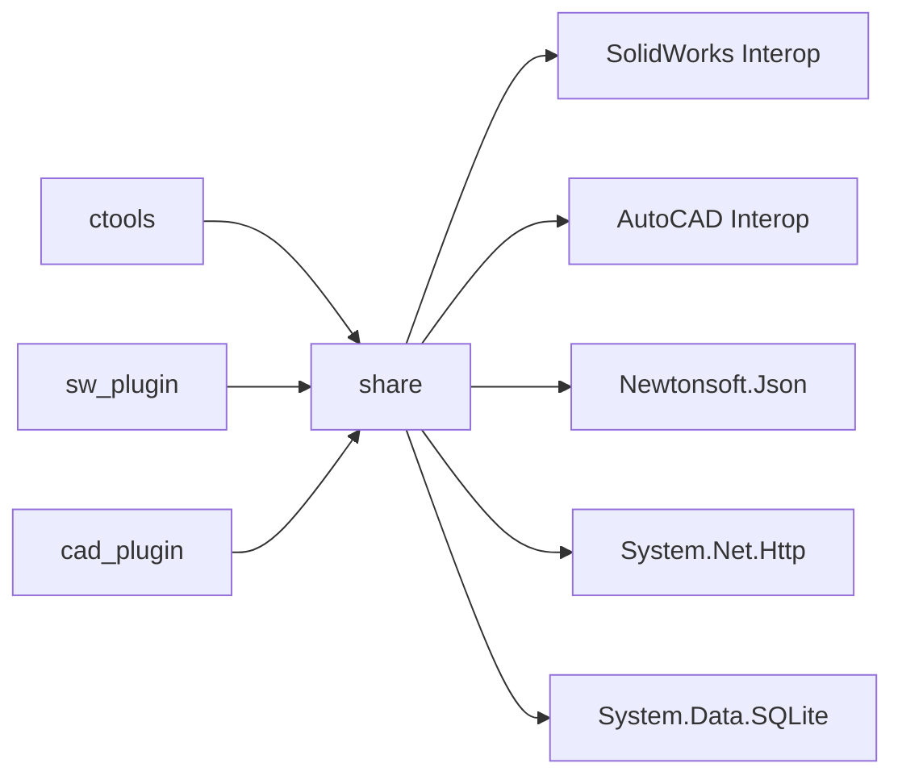

# 环境配置

<cite>
**本文引用的文件**
- [my_ai.sln](file://my_ai.sln)
- [README.md](file://README.md)
- [cad_plugin.csproj](file://cad_plugin/cad_plugin.csproj)
- [sw_plugin.csproj](file://sw_plugin/sw_plugin.csproj)
- [ctool.csproj](file://ctools/ctool.csproj)
- [share.csproj](file://share/share.csproj)
- [launchSettings.json (cad_plugin)](file://cad_plugin/Properties/launchSettings.json)
- [launchSettings.json (ctools)](file://ctools/Properties/launchSettings.json)
- [launchSettings.json (sw_plugin)](file://sw_plugin/Properties/launchSettings.json)
- [App.config (sw_plugin)](file://sw_plugin/App.config)
- [sw_plugin.dll.config (生成物)](file://sw_plugin/bin/Debug/net48/sw_plugin.dll.config)
- [main.cs (ctools)](file://ctools/main.cs)
- [connect.cs](file://ctools/connect.cs)
- [llm_service.cs](file://share/nomal/llm_service.cs)
</cite>

## 目录
1. [引言](#引言)
2. [项目结构](#项目结构)
3. [核心组件](#核心组件)
4. [架构总览](#架构总览)
5. [详细组件分析](#详细组件分析)
6. [依赖关系分析](#依赖关系分析)
7. [性能考虑](#性能考虑)
8. [故障排查指南](#故障排查指南)
9. [结论](#结论)
10. [附录](#附录)

## 引言
本指南面向开发、测试与生产环境的运维与开发者，系统化说明本项目的环境配置差异与设置方法，覆盖 .NET Framework 与 .NET 9.0 的运行时要求、配置文件结构与关键参数、LLM 服务配置、数据库连接字符串与日志级别、跨操作系统环境变量、网络与代理、以及环境切换与配置管理最佳实践。

## 项目结构
该项目采用多项目解决方案组织，包含命令行工具、SolidWorks 插件、AutoCAD 插件与共享库。核心差异体现在目标框架与平台能力上：
- 命令行工具（ctools）使用 .NET 9.0，具备 Windows Forms 与控制台交互能力
- SolidWorks 插件与共享库使用 .NET Framework 4.8，依赖 COM 互操作与 Interop 类库
- AutoCAD 插件与共享库同样依赖 Interop 类库，目标框架为 .NET Framework 4.8

图表来源
- [my_ai.sln:1-43](file://my_ai.sln#L1-L43)
- [ctool.csproj:1-55](file://ctools/ctool.csproj#L1-L55)
- [sw_plugin.csproj:1-74](file://sw_plugin/sw_plugin.csproj#L1-L74)
- [cad_plugin.csproj:1-46](file://cad_plugin/cad_plugin.csproj#L1-L46)
- [share.csproj:1-40](file://share/share.csproj#L1-L40)

章节来源
- [my_ai.sln:1-43](file://my_ai.sln#L1-L43)
- [README.md:193-249](file://README.md#L193-L249)

## 核心组件
- 目标框架与运行时
  - ctools：.NET 9.0-windows，支持 Windows Forms 与控制台编码 UTF-8
  - sw_plugin / share：.NET Framework 4.8，启用 COM 互操作与 Windows Forms
  - cad_plugin：.NET Framework 4.8，启用 COM 互操作与 Windows Forms
- 依赖库
  - 共享库引入 Newtonsoft.Json、System.Net.Http、System.Data.SQLite
  - 插件与工具引用 SolidWorks 与 AutoCAD Interop 类库
- 启动配置
  - 各项目提供 launchSettings.json，定义调试启动配置与可执行路径
  - sw_plugin 提供 App.config（空配置），生成物中存在 dll.config

章节来源
- [ctool.csproj:1-55](file://ctools/ctool.csproj#L1-L55)
- [sw_plugin.csproj:1-74](file://sw_plugin/sw_plugin.csproj#L1-L74)
- [cad_plugin.csproj:1-46](file://cad_plugin/cad_plugin.csproj#L1-L46)
- [share.csproj:1-40](file://share/share.csproj#L1-L40)
- [launchSettings.json (ctools):1-14](file://ctools/Properties/launchSettings.json#L1-L14)
- [launchSettings.json (sw_plugin):1-12](file://sw_plugin/Properties/launchSettings.json#L1-L12)
- [launchSettings.json (cad_plugin):1-11](file://cad_plugin/Properties/launchSettings.json#L1-L11)
- [App.config (sw_plugin):1-3](file://sw_plugin/App.config#L1-L3)
- [sw_plugin.dll.config (生成物):1-3](file://sw_plugin/bin/Debug/net48/sw_plugin.dll.config#L1-L3)

## 架构总览
下图展示各组件在不同环境中的职责与交互，重点体现 LLM 服务、数据库与日志、以及与 SolidWorks 的连接流程。

图表来源
- [ctools/main.cs:54-109](file://ctools/main.cs#L54-L109)
- [connect.cs:11-51](file://ctools/connect.cs#L11-L51)
- [llm_service.cs:18-53](file://share/nomal/llm_service.cs#L18-L53)
- [share.csproj:27-29](file://share/share.csproj#L27-L29)

## 详细组件分析

### .NET 运行时与目标框架
- ctools
  - 目标框架：net9.0-windows
  - 特性：启用 Windows Forms、UTF-8 控制台编码、显式包引用 Newtonsoft.Json
- sw_plugin / share / cad_plugin
  - 目标框架：net48（.NET Framework 4.8）
  - 特性：启用 COM 互操作、Windows Forms、LangVersion 与 Nullable 配置
- 依赖 Interop
  - SolidWorks：Interop.sldworks、Interop.swconst、Interop.swpublished、SolidWorksTools
  - AutoCAD：AutoCAD.Interop、AutoCAD.Interop.Common

章节来源
- [ctool.csproj:3-14](file://ctools/ctool.csproj#L3-L14)
- [sw_plugin.csproj:3-14](file://sw_plugin/sw_plugin.csproj#L3-L14)
- [share.csproj:3-9](file://share/share.csproj#L3-L9)
- [cad_plugin.csproj:3-14](file://cad_plugin/cad_plugin.csproj#L3-L14)

### 配置文件结构与关键参数
- 通用配置位置
  - sw_plugin：App.config（空配置），生成物 dll.config（空配置）
  - ctools：无独立 App.config，通过环境变量与命令行参数驱动
- 关键参数
  - LLM API Key：通过环境变量 DASHSCOPE_API_KEY 注入
  - LLM 模型与端点：默认模型与 DashScope 兼容模式端点在 LLM 服务中硬编码
  - SQLite 连接字符串：在共享库中通过 System.Data.SQLite 引用，具体连接字符串未在仓库中出现
  - 日志与内存：LLM 服务在 llm 目录下维护短期记忆、长期日志与工作知识文件
- 启动配置
  - ctools：launchSettings.json 定义命令行参数与启动行为
  - sw_plugin / cad_plugin：launchSettings.json 指定可执行路径（SolidWorks/AutoCAD）

章节来源
- [App.config (sw_plugin):1-3](file://sw_plugin/App.config#L1-L3)
- [sw_plugin.dll.config (生成物):1-3](file://sw_plugin/bin/Debug/net48/sw_plugin.dll.config#L1-L3)
- [llm_service.cs:20-53](file://share/nomal/llm_service.cs#L20-L53)
- [llm_service.cs:461-480](file://share/nomal/llm_service.cs#L461-L480)
- [launchSettings.json (ctools):1-14](file://ctools/Properties/launchSettings.json#L1-L14)
- [launchSettings.json (sw_plugin):1-12](file://sw_plugin/Properties/launchSettings.json#L1-L12)
- [launchSettings.json (cad_plugin):1-11](file://cad_plugin/Properties/launchSettings.json#L1-L11)

### LLM 服务配置（DashScope）
- 认证与密钥
  - 通过环境变量 DASHSCOPE_API_KEY 读取；若缺失，交互式提示输入
- 模型与端点
  - 默认模型与 DashScope 兼容模式聊天接口地址在代码中定义
- 流式调用与工具调用
  - 支持纯文本对话与带工具调用的对话，内部对消息历史、工作知识与运行日志进行管理
- 文件存储
  - llm 目录下短期记忆、长期日志、工作知识与运行日志文件

图表来源
- [ctools/main.cs:78-90](file://ctools/main.cs#L78-L90)
- [llm_service.cs:547-614](file://share/nomal/llm_service.cs#L547-L614)
- [llm_service.cs:706-800](file://share/nomal/llm_service.cs#L706-L800)

章节来源
- [llm_service.cs:18-53](file://share/nomal/llm_service.cs#L18-L53)
- [llm_service.cs:461-480](file://share/nomal/llm_service.cs#L461-L480)
- [llm_service.cs:547-614](file://share/nomal/llm_service.cs#L547-L614)
- [llm_service.cs:706-800](file://share/nomal/llm_service.cs#L706-L800)

### 数据库与日志
- 数据库
  - 通过 System.Data.SQLite 引用，未在仓库中发现连接字符串配置
- 日志
  - LLM 服务维护运行日志文件，支持从文件末尾读取最近内容
  - 控制台输出用于调试与运行时信息

章节来源
- [share.csproj:27-29](file://share/share.csproj#L27-L29)
- [llm_service.cs:395-456](file://share/nomal/llm_service.cs#L395-L456)

### 与 SolidWorks 的连接
- 连接逻辑
  - 通过 COM 获取或创建 SldWorks 应用实例，要求 Windows 平台
- 启动方式
  - ctools 在无参数时尝试连接并初始化上下文
  - launchSettings.json 提供 SolidWorks 可执行路径配置

图表来源
- [ctools/main.cs:62-91](file://ctools/main.cs#L62-L91)
- [connect.cs:11-51](file://ctools/connect.cs#L11-L51)

章节来源
- [connect.cs:11-51](file://ctools/connect.cs#L11-L51)
- [launchSettings.json (sw_plugin):3-10](file://sw_plugin/Properties/launchSettings.json#L3-L10)

### 网络、防火墙与代理
- 网络要求
  - LLM 服务通过 HTTPS 访问 DashScope API，需允许出站 TCP 443
- 代理配置
  - 通过系统 HTTP 代理或系统网络代理设置生效（取决于运行环境）
- 防火墙
  - 需放行本地回环与外网出站流量，确保 API 调用可达

章节来源
- [llm_service.cs:23-37](file://share/nomal/llm_service.cs#L23-L37)

### 环境变量配置（跨操作系统）
- Windows
  - DASHSCOPE_API_KEY：在用户或系统环境变量中设置
  - SolidWorks/AutoCAD 可执行路径：通过 launchSettings.json 指定
- Linux/macOS
  - 本项目针对 Windows 平台，.NET 9.0 与 Interop 依赖不适用于非 Windows 系统
  - 若需在非 Windows 环境运行，需评估替代方案与运行时支持

章节来源
- [llm_service.cs:461-480](file://share/nomal/llm_service.cs#L461-L480)
- [launchSettings.json (sw_plugin):3-10](file://sw_plugin/Properties/launchSettings.json#L3-L10)
- [launchSettings.json (cad_plugin):6-9](file://cad_plugin/Properties/launchSettings.json#L6-L9)

### 环境切换与配置管理最佳实践
- 开发环境
  - 使用 launchSettings.json 指定本地 SolidWorks/AutoCAD 可执行路径
  - 在用户环境变量中设置 DASHSCOPE_API_KEY
- 测试环境
  - 保持与开发一致的环境变量与配置文件结构
  - 使用独立的 llm 子目录隔离短期记忆与日志
- 生产环境
  - 通过系统级环境变量注入密钥，避免硬编码
  - 将 SQLite 数据库置于受控目录，确保权限与备份策略
  - 记录网络策略与代理配置，便于审计与排障

章节来源
- [launchSettings.json (ctools):1-14](file://ctools/Properties/launchSettings.json#L1-L14)
- [launchSettings.json (sw_plugin):1-12](file://sw_plugin/Properties/launchSettings.json#L1-L12)
- [launchSettings.json (cad_plugin):1-11](file://cad_plugin/Properties/launchSettings.json#L1-L11)
- [llm_service.cs:461-480](file://share/nomal/llm_service.cs#L461-L480)

## 依赖关系分析
- 项目间依赖
  - ctools 与 sw_plugin 依赖 share
  - share 引用 Interop 与第三方包（JSON、HTTP、SQLite）
- 外部依赖
  - SolidWorks 与 AutoCAD Interop
  - DashScope API（HTTPS）

图表来源
- [ctool.csproj:24-26](file://ctools/ctool.csproj#L24-L26)
- [sw_plugin.csproj:24-26](file://sw_plugin/sw_plugin.csproj#L24-L26)
- [share.csproj:11-30](file://share/share.csproj#L11-L30)

章节来源
- [ctool.csproj:24-26](file://ctools/ctool.csproj#L24-L26)
- [sw_plugin.csproj:24-26](file://sw_plugin/sw_plugin.csproj#L24-L26)
- [share.csproj:11-30](file://share/share.csproj#L11-L30)

## 性能考虑
- 控制台编码与日志
  - ctools 使用 UTF-8 控制台编码，减少字符集转换开销
- LLM 调用
  - 限制短期记忆条目数量，避免上下文膨胀
  - 读取最近运行日志时采用从文件末尾向前读取策略，降低 I/O 成本
- 命令相似度匹配
  - 命令搜索采用分词与编辑距离结合的策略，兼顾中文与英文场景

章节来源
- [ctool.csproj:11-12](file://ctools/ctool.csproj#L11-L12)
- [llm_service.cs:92-114](file://share/nomal/llm_service.cs#L92-L114)
- [llm_service.cs:395-456](file://share/nomal/llm_service.cs#L395-L456)
- [llm_service.cs:139-311](file://share/nomal/llm_service.cs#L139-L311)

## 故障排查指南
- 插件注册失败
  - 确保以管理员身份运行注册脚本；检查 DLL 是否存在于发布目录；确认 SolidWorks 版本兼容
- SolidWorks 无法连接
  - 先启动 SolidWorks；确保存在活动文档；以管理员身份运行 ctools
- 命令执行无响应
  - 查看控制台输出；检查 SolidWorks 是否弹出错误；确认当前文档类型符合命令要求
- AI 对话无法识别命令
  - 使用更明确的命令描述；使用 search 命令查看可用命令列表；切换到直接命令模式
- LLM API Key 缺失
  - 在环境变量中设置 DASHSCOPE_API_KEY；或在交互式提示中输入临时 Key

章节来源
- [README.md:281-317](file://README.md#L281-L317)
- [llm_service.cs:461-480](file://share/nomal/llm_service.cs#L461-L480)

## 结论
本项目在 Windows 平台上通过 .NET 9.0 与 .NET Framework 4.8 的组合实现命令行工具与插件生态，借助 DashScope API 与 SQLite 实现智能对话与数据持久化。建议在开发、测试与生产环境中统一使用环境变量管理密钥与路径，通过独立目录隔离日志与短期记忆，并遵循最小暴露原则与审计策略。

## 附录
- 快速对照表
  - 目标框架：ctools (.NET 9.0)；sw_plugin / share / cad_plugin (.NET Framework 4.8)
  - LLM 密钥：DASHSCOPE_API_KEY
  - Interop 依赖：SolidWorks 与 AutoCAD Interop
  - 日志与内存：llm 目录下的短期记忆、长期日志、工作知识与运行日志
  - 启动路径：launchSettings.json 中的可执行路径