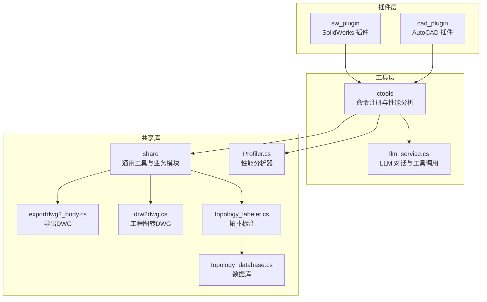
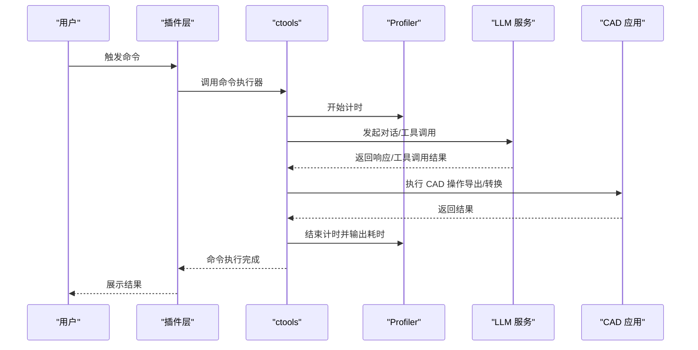
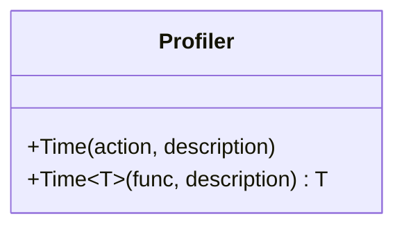
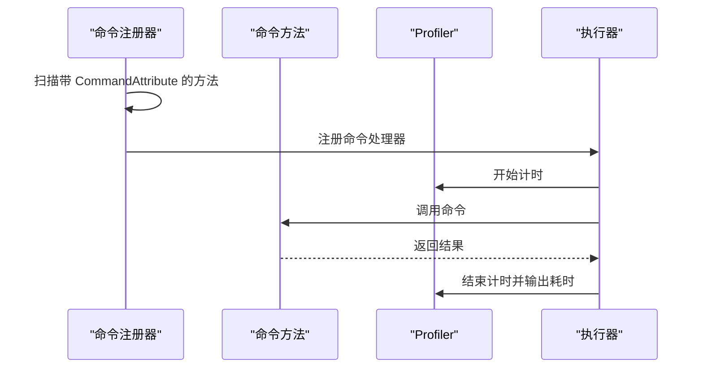
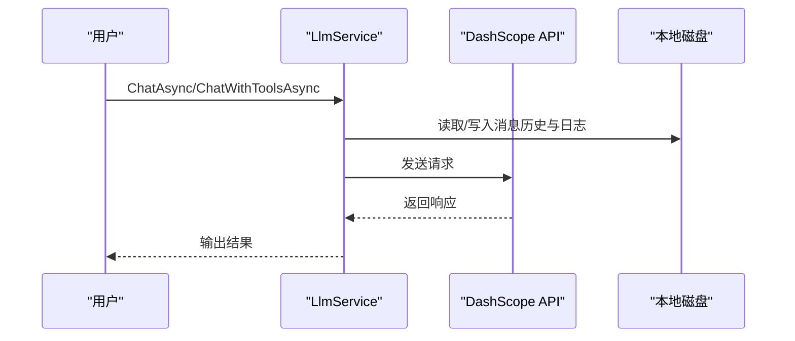
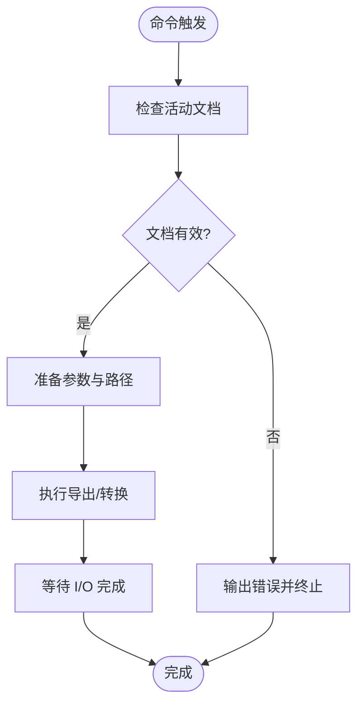
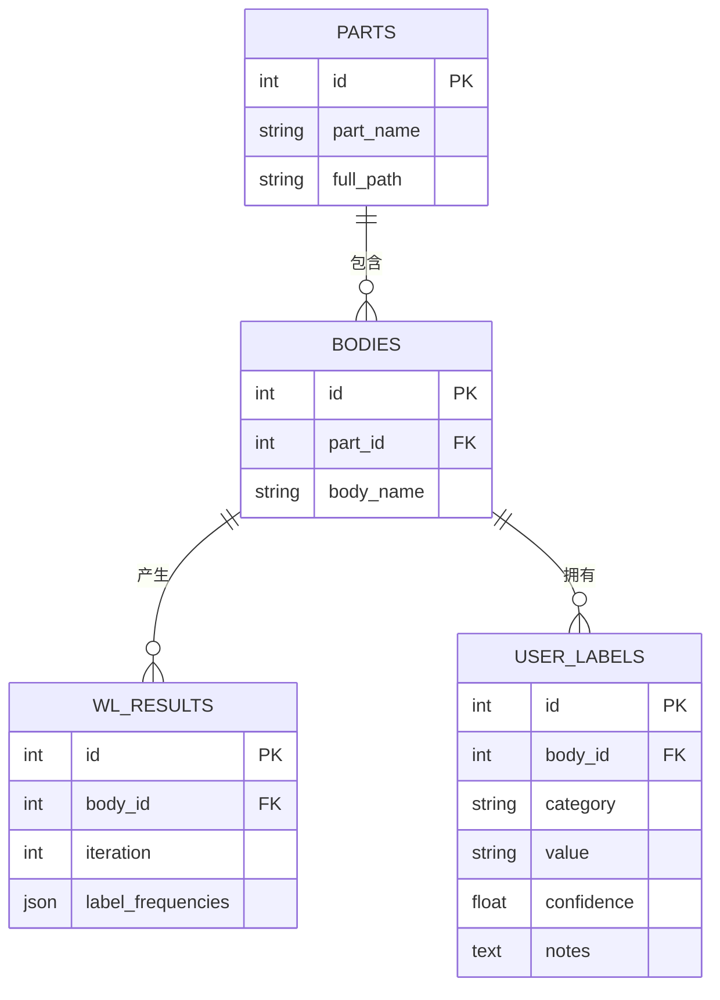
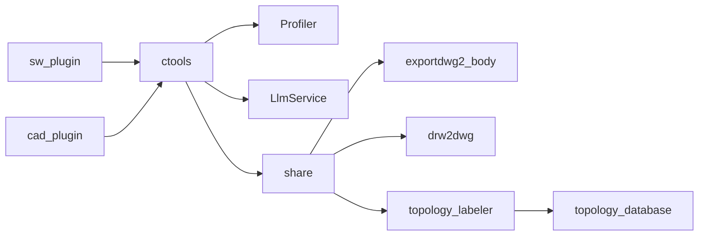

# 监控与性能优化

<cite>
**本文档引用的文件**
- [Profiler.cs](file://share/nomal/Profiler.cs)
- [llm_service.cs](file://share/nomal/llm_service.cs)
- [main.cs](file://ctools/main.cs)
- [asm_commands.cs](file://ctools/solidworks_commands/asm_commands.cs)
- [connect.cs](file://ctools/connect.cs)
- [function.cs](file://sw_plugin/function.cs)
- [exportdwg2_body.cs](file://share/part/exportdwg2_body.cs)
- [drw2dwg.cs](file://share/drw/drw2dwg.cs)
- [topology_labeler.cs](file://share/train/topology_labeler.cs)
- [topology_database.cs](file://share/train/topology_database.cs)
- [register_addin.bat](file://sw_plugin/register_addin.bat)
- [register.ps1](file://cad_plugin/register.ps1)
- [launchSettings.json (sw_plugin)](file://sw_plugin/Properties/launchSettings.json)
- [launchSettings.json (cad_plugin)](file://cad_plugin/Properties/launchSettings.json)
</cite>

## 目录
1. [简介](#简介)
2. [项目结构](#项目结构)
3. [核心组件](#核心组件)
4. [架构总览](#架构总览)
5. [详细组件分析](#详细组件分析)
6. [依赖关系分析](#依赖关系分析)
7. [性能考量](#性能考量)
8. [故障排查指南](#故障排查指南)
9. [结论](#结论)
10. [附录](#附录)

## 简介
本指南面向系统监控与性能优化，结合仓库中的实际实现，提供一套可落地的性能监控指标定义、测量方法、工具使用、瓶颈识别与优化策略、负载与压力测试方法、资源监控与告警配置以及持续性能评估实践。重点覆盖以下方面：
- 性能监控指标：CPU、内存、I/O、网络、响应时间、吞吐量、错误率等
- 内置性能分析器与第三方监控集成
- 代码与系统层面的优化策略
- 负载与压力测试流程
- 资源监控与告警配置
- 基准测试与持续评估

## 项目结构
该项目由多个子项目组成，围绕 SolidWorks 与 AutoCAD 插件及共享工具库展开，形成“插件层 → 工具层 → 共享库”的层次化结构。性能监控与优化主要体现在：
- 插件层：负责与 CAD 应用交互，执行命令与批处理
- 工具层：封装命令注册、性能分析器、LLM 对话与工具调用
- 共享库：通用工具（剪贴板、性能分析、训练与标注等）

**图表来源**
- [function.cs](file://sw_plugin/function.cs)
- [main.cs](file://ctools/main.cs)
- [llm_service.cs](file://share/nomal/llm_service.cs)
- [Profiler.cs](file://share/nomal/Profiler.cs)
- [exportdwg2_body.cs](file://share/part/exportdwg2_body.cs)
- [drw2dwg.cs](file://share/drw/drw2dwg.cs)
- [topology_labeler.cs](file://share/train/topology_labeler.cs)
- [topology_database.cs](file://share/train/topology_database.cs)

**章节来源**
- [function.cs](file://sw_plugin/function.cs)
- [main.cs](file://ctools/main.cs)
- [llm_service.cs](file://share/nomal/llm_service.cs)
- [Profiler.cs](file://share/nomal/Profiler.cs)

## 核心组件
- 性能分析器（Profiler）：提供统一的时间测量能力，支持 Action 与 Func<T>，输出毫秒级耗时
- 命令注册与性能监控（ctools）：通过装饰器属性标记命令，自动统计执行耗时
- LLM 服务：封装 DashScope API 调用，记录请求耗时与状态
- CAD 命令执行：SolidWorks 与 AutoCAD 插件中的命令实现，涉及大量 I/O 与 COM 调用
- 数据处理与标注：拓扑标注与数据库操作，涉及文件系统与 SQLite

**章节来源**
- [Profiler.cs](file://share/nomal/Profiler.cs)
- [main.cs](file://ctools/main.cs)
- [llm_service.cs](file://share/nomal/llm_service.cs)
- [function.cs](file://sw_plugin/function.cs)

## 架构总览
整体架构采用“插件驱动 + 工具调度 + 共享库”的设计，性能监控贯穿命令执行、网络请求与文件操作三个关键路径。

**图表来源**
- [main.cs](file://ctools/main.cs)
- [llm_service.cs](file://share/nomal/llm_service.cs)
- [function.cs](file://sw_plugin/function.cs)

## 详细组件分析

### 组件A：性能分析器（Profiler）
- 功能：提供统一的性能测量入口，支持无返回值与有返回值两种委托
- 测量粒度：毫秒级，输出到控制台
- 使用场景：命令执行、关键算法、I/O 操作前后

**图表来源**
- [Profiler.cs](file://share/nomal/Profiler.cs)

**章节来源**
- [Profiler.cs](file://share/nomal/Profiler.cs)

### 组件B：命令注册与性能监控（ctools）
- 功能：动态扫描带有 CommandAttribute 的方法，构建命令字典；支持 Profiled 装饰器自动统计耗时
- 性能输出：同步/异步命令分别统计执行耗时，输出到控制台
- 适用范围：所有通过命令注册器注册的命令

**图表来源**
- [main.cs](file://ctools/main.cs)

**章节来源**
- [main.cs](file://ctools/main.cs)

### 组件C：LLM 服务与性能监控
- 功能：封装 DashScope API 调用，支持文本与图像（VLM）对话，记录请求耗时
- 性能关注点：网络延迟、超时、重试、日志与内存占用
- 工具调用：支持工具调用模式，记录工具调用耗时

**图表来源**
- [llm_service.cs](file://share/nomal/llm_service.cs)

**章节来源**
- [llm_service.cs](file://share/nomal/llm_service.cs)

### 组件D：CAD 命令执行（SolidWorks 与 AutoCAD）
- SolidWorks：命令通过插件注册，调用共享库中的导出/转换逻辑
- AutoCAD：通过脚本注册插件，提供命令入口
- 性能关注点：COM 调用、文件系统 I/O、UI 操作

**图表来源**
- [function.cs](file://sw_plugin/function.cs)
- [exportdwg2_body.cs](file://share/part/exportdwg2_body.cs)
- [drw2dwg.cs](file://share/drw/drw2dwg.cs)

**章节来源**
- [function.cs](file://sw_plugin/function.cs)
- [exportdwg2_body.cs](file://share/part/exportdwg2_body.cs)
- [drw2dwg.cs](file://share/drw/drw2dwg.cs)

### 组件E：拓扑标注与数据库（性能相关）
- 功能：构建拓扑图、执行 WL 迭代、存储与查询标注
- 性能关注点：SQLite 写入、JSON 序列化/反序列化、大对象处理
- 优化建议：批量写入、索引优化、减少不必要的序列化

**图表来源**
- [topology_labeler.cs](file://share/train/topology_labeler.cs)
- [topology_database.cs](file://share/train/topology_database.cs)

**章节来源**
- [topology_labeler.cs](file://share/train/topology_labeler.cs)
- [topology_database.cs](file://share/train/topology_database.cs)

## 依赖关系分析
- 插件层依赖工具层与共享库
- 工具层依赖性能分析器与 LLM 服务
- 共享库内部模块相互协作，数据库承担持久化职责
- 第三方依赖：SolidWorks/ AutoCAD COM、DashScope API、SQLite

**图表来源**
- [function.cs](file://sw_plugin/function.cs)
- [main.cs](file://ctools/main.cs)
- [Profiler.cs](file://share/nomal/Profiler.cs)
- [llm_service.cs](file://share/nomal/llm_service.cs)
- [exportdwg2_body.cs](file://share/part/exportdwg2_body.cs)
- [drw2dwg.cs](file://share/drw/drw2dwg.cs)
- [topology_labeler.cs](file://share/train/topology_labeler.cs)
- [topology_database.cs](file://share/train/topology_database.cs)

**章节来源**
- [function.cs](file://sw_plugin/function.cs)
- [main.cs](file://ctools/main.cs)

## 性能考量
- 指标定义与测量
  - 响应时间：命令执行耗时、LLM 请求耗时、CAD 操作耗时
  - 吞吐量：单位时间内完成的命令数/请求数
  - 错误率：异常抛出与失败请求占比
  - 资源占用：CPU、内存、磁盘 I/O、网络 I/O
- 测量方法
  - 使用内置性能分析器（Profiler）对关键路径进行采样
  - 在命令执行器中统一输出耗时
  - 在 LLM 服务中记录请求耗时与状态
- 优化策略
  - 代码层面：减少不必要的 I/O、缓存热点数据、避免阻塞调用
  - 系统配置：合理设置超时、并发限制、线程池大小
  - 第三方集成：优化网络请求、启用连接复用、降级策略

[本节为通用指导，无需特定文件引用]

## 故障排查指南
- 插件注册与启动
  - SolidWorks 插件：使用批处理脚本注册，确保以管理员权限运行
  - AutoCAD 插件：使用 PowerShell 脚本扫描并注册，检查 DLL 路径与版本
- 运行时错误
  - 控制台输出包含详细错误信息，定位到具体命令或方法
  - LLM 服务中对 API Key 缺失、网络异常进行明确提示
- 性能问题定位
  - 使用命令执行器输出的耗时信息，结合 Profiler 对关键方法进行测量
  - 检查 CAD 操作的 I/O 路径与文件夹是否存在

**章节来源**
- [register_addin.bat](file://sw_plugin/register_addin.bat)
- [register.ps1](file://cad_plugin/register.ps1)
- [main.cs](file://ctools/main.cs)
- [llm_service.cs](file://share/nomal/llm_service.cs)

## 结论
本项目通过“命令注册 + 性能分析器 + LLM 集成 + CAD 插件”的组合，形成了可扩展的性能监控与优化体系。建议在生产环境中：
- 建立统一的性能指标采集与可视化平台
- 对关键路径进行持续基准测试与回归评估
- 结合日志与告警机制，实现自动化监控与预警
- 持续优化 I/O 与网络调用，减少阻塞与资源争用

[本节为总结性内容，无需特定文件引用]

## 附录

### A. 性能监控指标与测量清单
- 响应时间：命令执行、LLM 请求、CAD 操作
- 吞吐量：每秒命令数、请求数
- 错误率：异常与失败比例
- 资源占用：CPU 百分比、内存使用峰值、磁盘 I/O、网络带宽
- 业务指标：导出成功率、标注完成率、数据库写入耗时

[本节为通用指导，无需特定文件引用]

### B. 负载与压力测试方法
- 负载测试：逐步增加并发命令数，观察响应时间与错误率变化
- 压力测试：达到系统极限，记录崩溃点与恢复时间
- 场景设计：典型 CAD 操作（导出、转换、标注）组合场景
- 工具建议：JMeter、k6、Locust 等

[本节为通用指导，无需特定文件引用]

### C. 资源监控与告警配置
- 监控项：CPU、内存、磁盘、网络、进程状态
- 告警阈值：基于历史基线与 SLA 设定
- 告警渠道：邮件、IM、电话
- 工具建议：Prometheus/Grafana、Zabbix、Azure Monitor

[本节为通用指导，无需特定文件引用]

### D. 基准测试与持续评估
- 基准测试：固定场景与数据集，定期运行并记录指标
- 回归评估：每次变更后对比基线，识别回归
- 报告与追踪：建立指标仪表板与问题追踪流程

[本节为通用指导，无需特定文件引用]