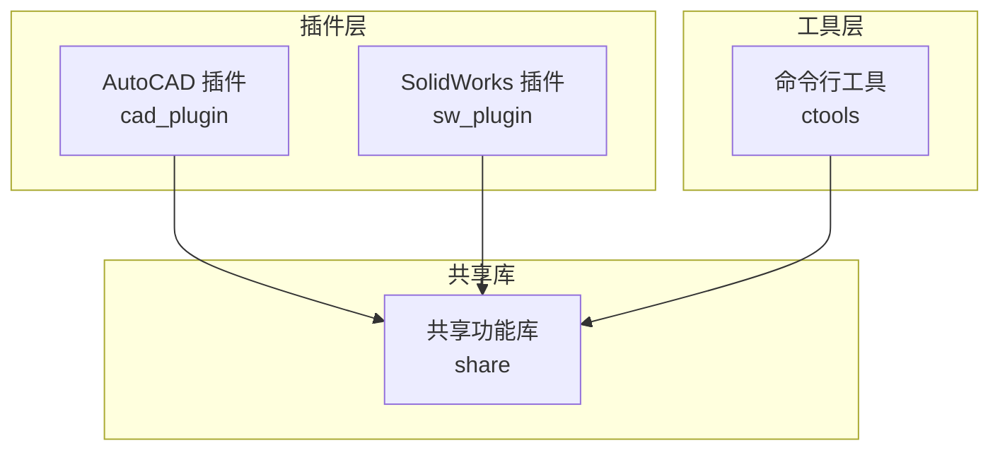
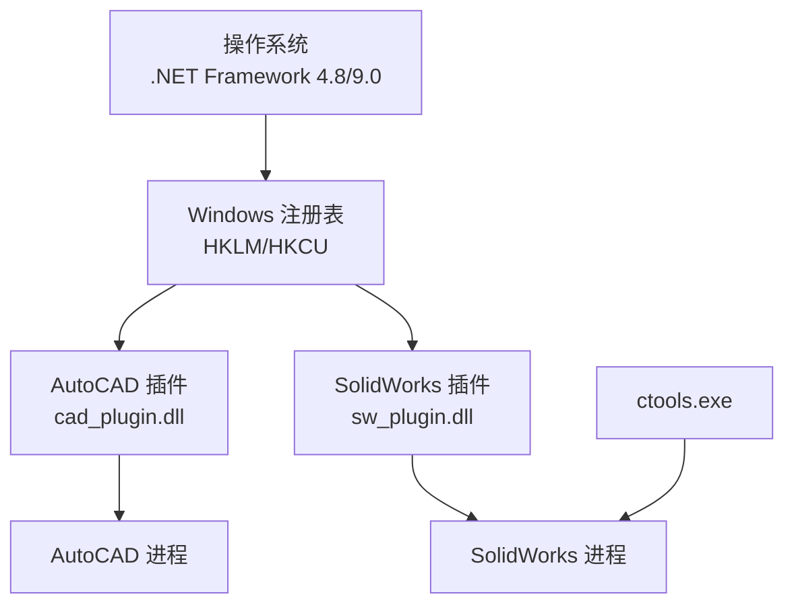
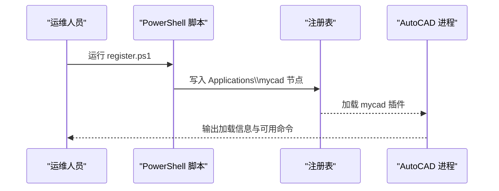
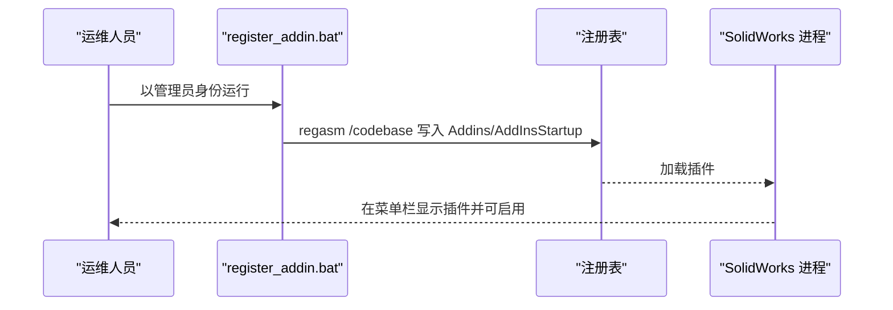
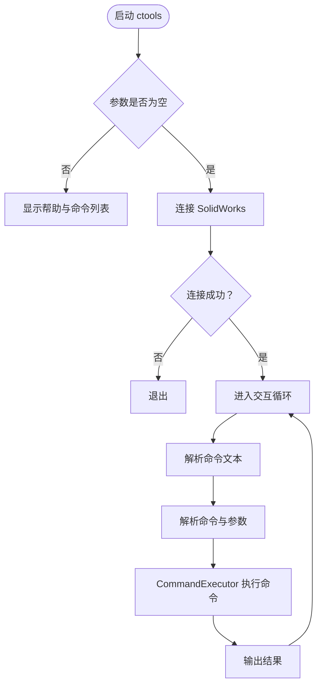
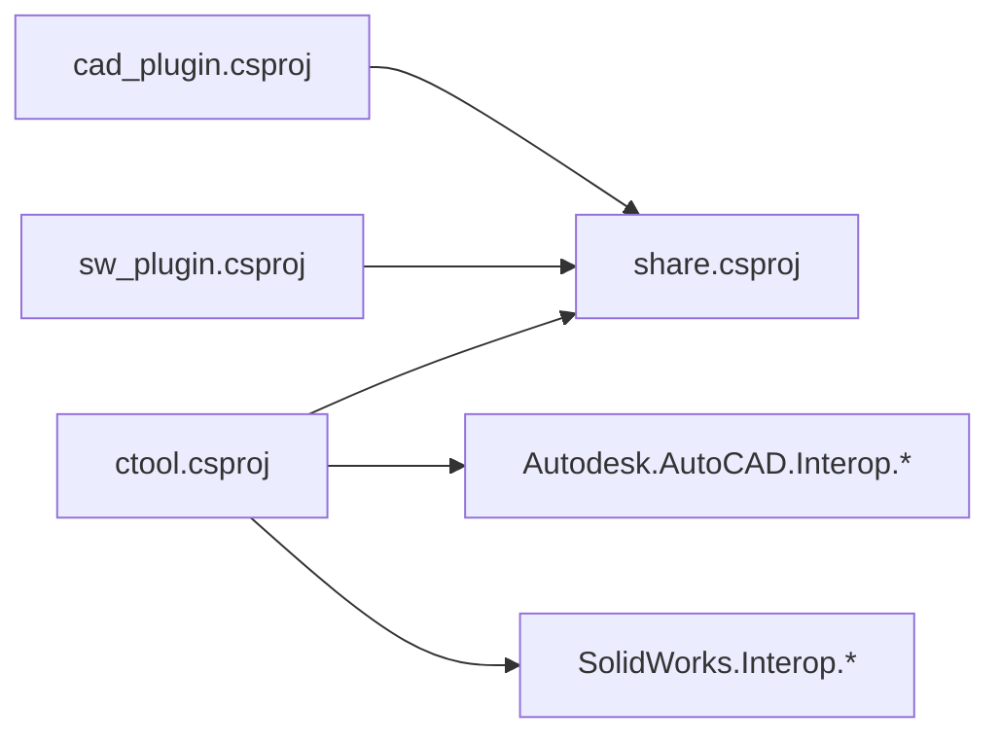

# 部署与运维

<cite>
**本文引用的文件**
- [README.md](file://README.md)
- [register.ps1](file://cad_plugin/register.ps1)
- [unregister.ps1](file://cad_plugin/unregister.ps1)
- [register_addin.bat](file://sw_plugin/register_addin.bat)
- [unregister_addin.bat](file://sw_plugin/unregister_addin.bat)
- [cad_plugin.csproj](file://cad_plugin/cad_plugin.csproj)
- [sw_plugin.csproj](file://sw_plugin/sw_plugin.csproj)
- [launchSettings.json（CAD）](file://cad_plugin/Properties/launchSettings.json)
- [launchSettings.json（SolidWorks）](file://sw_plugin/Properties/launchSettings.json)
- [App.config（SolidWorks）](file://sw_plugin/App.config)
- [ctool.csproj](file://ctools/ctool.csproj)
- [share.csproj](file://share/share.csproj)
- [addin.cs](file://sw_plugin/addin.cs)
- [cad_addin.cs](file://cad_plugin/cad_addin.cs)
- [main.cs（ctools）](file://ctools/main.cs)
- [command_executor.cs](file://ctools/command_executor.cs)
</cite>

## 目录
1. [引言](#引言)
2. [项目结构](#项目结构)
3. [核心组件](#核心组件)
4. [架构总览](#架构总览)
5. [详细组件分析](#详细组件分析)
6. [依赖关系分析](#依赖关系分析)
7. [性能考虑](#性能考虑)
8. [故障排除指南](#故障排除指南)
9. [结论](#结论)
10. [附录](#附录)

## 引言
本指南面向运维与开发团队，提供针对本仓库中 SolidWorks 与 AutoCAD 插件及命令行工具的完整部署与运维操作手册。内容涵盖：
- 插件部署流程（注册与注销）
- 不同环境下的配置要点（开发、测试、生产）
- 故障排除方法与常见问题诊断
- 性能监控与日志管理最佳实践
- 版本管理与升级策略
- 安全配置与权限管理注意事项
- 便于一线运维人员高效管理与维护系统

## 项目结构
本仓库包含三个主要部分：
- cad_plugin：AutoCAD 插件（基于 .NET Framework 4.8，COM 托管）
- sw_plugin：SolidWorks 插件（基于 .NET Framework 4.8，COM 托管）
- ctools：命令行工具（基于 .NET 9.0，Windows Forms），用于与 SolidWorks 交互与 AI 对话

图表来源
- [cad_plugin.csproj:1-46](file://cad_plugin/cad_plugin.csproj#L1-L46)
- [sw_plugin.csproj:1-74](file://sw_plugin/sw_plugin.csproj#L1-L74)
- [ctool.csproj:1-55](file://ctools/ctool.csproj#L1-L55)
- [share.csproj:1-40](file://share/share.csproj#L1-L40)

章节来源
- [README.md: 193-249:193-249](file://README.md#L193-L249)

## 核心组件
- AutoCAD 插件（cad_plugin）
  - 通过 PowerShell 脚本进行注册/注销，写入注册表 Applications 节点
  - 通过 IExtensionApplication 自动初始化并输出加载信息
- SolidWorks 插件（sw_plugin）
  - 通过批处理脚本使用 regasm 进行 COM 注册/注销
  - 通过 [SwAddin] 特性与 COM 回调机制集成到 SolidWorks
  - 提供欢迎界面、控制台输出窗口、右键菜单与命令管理器集成
- 命令行工具（ctools）
  - 交互式 AI 对话与命令执行，内置命令注册中心与模糊搜索
  - 支持性能监控装饰器与异步命令执行

章节来源
- [cad_addin.cs: 1-103:1-103](file://cad_plugin/cad_addin.cs#L1-L103)
- [addin.cs: 18-339:18-339](file://sw_plugin/addin.cs#L18-L339)
- [main.cs（ctools）: 34-377:34-377](file://ctools/main.cs#L34-L377)

## 架构总览
下图展示插件与工具层的部署与交互关系：

图表来源
- [register.ps1: 34-81:34-81](file://cad_plugin/register.ps1#L34-L81)
- [register_addin.bat: 7](file://sw_plugin/register_addin.bat#L7)
- [unregister.ps1: 69-81:69-81](file://cad_plugin/unregister.ps1#L69-L81)
- [unregister_addin.bat: 7](file://sw_plugin/unregister_addin.bat#L7)

## 详细组件分析

### AutoCAD 插件部署与注册
- 自动注册流程
  - 使用 PowerShell 脚本扫描注册表中所有 AutoCAD 版本并写入 Applications\mycad 节点
  - 写入描述、加载控制、加载器路径与托管标志
- 手动注册方法
  - 通过 regasm 指定 DLL 路径，写入注册表项
- 卸载流程
  - 扫描并删除 Applications\mycad 下的注册项
- 权限要求
  - 需以管理员身份运行脚本或 regasm

图表来源
- [register.ps1: 34-81:34-81](file://cad_plugin/register.ps1#L34-L81)
- [cad_addin.cs: 16-22:16-22](file://cad_plugin/cad_addin.cs#L16-L22)

章节来源
- [register.ps1: 1-93:1-93](file://cad_plugin/register.ps1#L1-L93)
- [unregister.ps1: 1-92:1-92](file://cad_plugin/unregister.ps1#L1-L92)
- [cad_addin.cs: 1-103:1-103](file://cad_plugin/cad_addin.cs#L1-L103)

### SolidWorks 插件部署与注册
- 自动注册流程
  - 使用批处理脚本以管理员身份运行 regasm，对 sw_plugin.dll 进行 /codebase 注册
  - 通过 COM 回调写入 Addins 与 AddInsStartup 注册表项
- 手动注册方法
  - 使用 regasm 指定 DLL 路径，附加 /tlb 可选
- 卸载流程
  - 使用 regasm /unregister 卸载
  - 或在 SolidWorks 插件管理中取消勾选
- 权限要求
  - 需以管理员身份运行 regasm 或批处理脚本

图表来源
- [register_addin.bat: 7](file://sw_plugin/register_addin.bat#L7)
- [addin.cs: 262-333:262-333](file://sw_plugin/addin.cs#L262-L333)

章节来源
- [register_addin.bat: 1-10:1-10](file://sw_plugin/register_addin.bat#L1-L10)
- [unregister_addin.bat: 1-11:1-11](file://sw_plugin/unregister_addin.bat#L1-L11)
- [addin.cs: 18-339:18-339](file://sw_plugin/addin.cs#L18-L339)

### 命令行工具（ctools）与命令执行
- 启动模式
  - 无参数：连接 SolidWorks，进入交互式 AI 对话模式
  - 有参数：显示帮助与命令列表
- 命令注册与执行
  - 通过反射扫描带 CommandAttribute 的方法，建立命令字典
  - CommandExecutor 解析命令文本，解析参数，调用对应 AsyncAction
- 性能监控
  - 通过 ProfiledAttribute 装饰器对命令执行进行计时统计

图表来源
- [main.cs（ctools）: 54-109:54-109](file://ctools/main.cs#L54-L109)
- [main.cs（ctools）: 170-253:170-253](file://ctools/main.cs#L170-L253)
- [command_executor.cs: 32-113:32-113](file://ctools/command_executor.cs#L32-L113)

章节来源
- [main.cs（ctools）: 34-377:34-377](file://ctools/main.cs#L34-L377)
- [command_executor.cs: 1-116:1-116](file://ctools/command_executor.cs#L1-L116)

### 配置文件与环境差异
- 开发环境
  - 使用 launchSettings.json 指定可执行路径，便于在 IDE 中直接启动 AutoCAD/SolidWorks
  - cad_plugin 的 launchSettings.json 指向 AutoCAD 2022
  - sw_plugin 的 launchSettings.json 指向本地 SolidWorks 安装路径
- 测试/生产环境
  - 优先使用注册脚本或批处理进行部署，避免手动干预
  - 确保 .NET Framework 4.8 与目标软件版本兼容
  - 生产环境建议固定版本号与构建时间戳，便于回溯与审计

章节来源
- [launchSettings.json（CAD）:1-11](file://cad_plugin/Properties/launchSettings.json#L1-L11)
- [launchSettings.json（SolidWorks）:1-12](file://sw_plugin/Properties/launchSettings.json#L1-L12)
- [App.config（SolidWorks）:1-3](file://sw_plugin/App.config#L1-L3)

## 依赖关系分析
- 项目间依赖
  - cad_plugin 与 sw_plugin 均引用 share 作为共享库
  - ctools 同时引用 share，并依赖 AutoCAD/SolidWorks Interop 类库
- 外部依赖
  - SolidWorks Interop（sldworks、swconst、swpublished）
  - AutoCAD Interop（Autodesk.AutoCAD.Interop.*）
  - Newtonsoft.Json、System.Net.Http、System.Data.SQLite

图表来源
- [cad_plugin.csproj:42-44](file://cad_plugin/cad_plugin.csproj#L42-L44)
- [sw_plugin.csproj:24-42](file://sw_plugin/sw_plugin.csproj#L24-L42)
- [ctool.csproj:29-41](file://ctools/ctool.csproj#L29-L41)

章节来源
- [cad_plugin.csproj: 1-L46:1-46](file://cad_plugin/cad_plugin.csproj#L1-L46)
- [sw_plugin.csproj: 1-L74:1-74](file://sw_plugin/sw_plugin.csproj#L1-L74)
- [ctool.csproj: 1-L55:1-55](file://ctools/ctool.csproj#L1-L55)
- [share.csproj: 1-L40:1-40](file://share/share.csproj#L1-L40)

## 性能考虑
- 命令执行性能
  - 使用 ProfiledAttribute 对命令执行进行计时，输出“性能”统计
  - 异步命令通过 Task 执行，避免阻塞 UI
- 日志与调试
  - 插件与工具均使用 Debug 输出与控制台输出，便于排查
  - 建议在生产环境统一收集 Debug 输出与控制台日志
- 资源与内存
  - 避免在命令执行过程中频繁创建大型对象
  - 对 SolidWorks 文档操作后及时释放引用

章节来源
- [main.cs（ctools）: 28-32:28-32](file://ctools/main.cs#L28-L32)
- [main.cs（ctools）: 209-232:209-232](file://ctools/main.cs#L209-L232)
- [addin.cs: 36-68:36-68](file://sw_plugin/addin.cs#L36-L68)

## 故障排除指南
- 插件注册失败
  - 确保以管理员身份运行注册脚本或批处理
  - 检查 DLL 是否存在于预期输出目录
  - 确认目标软件版本与 .NET Framework 兼容
- 在 SolidWorks 中找不到插件
  - 重新运行注册脚本或在 SolidWorks 插件管理中启用
  - 检查注册表项：SOFTWARE\SolidWorks\AddInsStartup
- ctools 无法连接 SolidWorks
  - 先启动 SolidWorks 并确保存在激活文档
  - 以管理员身份运行 ctools.exe
- 命令执行无响应
  - 查看控制台输出与 Debug 信息
  - 确认当前文档类型与命令要求一致
- AutoCAD 插件未加载
  - 检查 Applications\mycad 注册项是否存在
  - 使用卸载脚本清理后重试注册

章节来源
- [README.md: 281-340:281-340](file://README.md#L281-L340)
- [unregister.ps1: 69-81:69-81](file://cad_plugin/unregister.ps1#L69-L81)
- [unregister_addin.bat: 7](file://sw_plugin/unregister_addin.bat#L7)

## 结论
本指南提供了从部署到运维的全流程方法，覆盖了插件注册/注销、多环境配置、故障排除、性能与日志管理、版本与升级策略以及安全与权限注意事项。建议在生产环境中采用脚本化部署与集中化日志收集，结合版本号与构建时间戳实现可追溯性。

## 附录

### 不同环境下的配置要点
- 开发环境
  - 使用 launchSettings.json 指定 AutoCAD/SolidWorks 可执行路径
  - 使用 Debug 配置进行快速迭代
- 测试环境
  - 使用 Release 输出目录进行回归测试
  - 固定 .NET 与软件版本，确保一致性
- 生产环境
  - 使用注册脚本/批处理进行标准化部署
  - 统一日志采集与告警，定期巡检插件状态

章节来源
- [launchSettings.json（CAD）:1-11](file://cad_plugin/Properties/launchSettings.json#L1-L11)
- [launchSettings.json（SolidWorks）:1-12](file://sw_plugin/Properties/launchSettings.json#L1-L12)

### 版本管理与升级策略
- 版本标识
  - 插件与工具均通过构建时间戳标识版本
  - 建议在发布包中附带版本清单与变更日志
- 升级流程
  - 先卸载旧版本（使用对应卸载脚本/批处理）
  - 部署新版本 DLL
  - 重新注册并验证功能
- 回滚策略
  - 保留上一版本的注册表备份
  - 快速回滚至稳定版本并修复问题

章节来源
- [addin.cs: 124-129:124-129](file://sw_plugin/addin.cs#L124-L129)
- [main.cs（ctools）: 46-51:46-51](file://ctools/main.cs#L46-L51)

### 安全配置与权限管理
- 权限要求
  - 注册/卸载需管理员权限
  - 以管理员身份运行 regasm 与 PowerShell 脚本
- 最小权限原则
  - 仅授予必要的注册表写入权限
  - 避免在非必要情况下提升权限
- 安全审计
  - 记录每次注册/卸载的时间、操作人与结果
  - 对敏感路径（DLL、注册表项）进行访问控制

章节来源
- [register.ps1: 6-12:6-12](file://cad_plugin/register.ps1#L6-L12)
- [register_addin.bat: 7](file://sw_plugin/register_addin.bat#L7)
- [unregister.ps1: 6-12:6-12](file://cad_plugin/unregister.ps1#L6-L12)
- [unregister_addin.bat: 7](file://sw_plugin/unregister_addin.bat#L7)