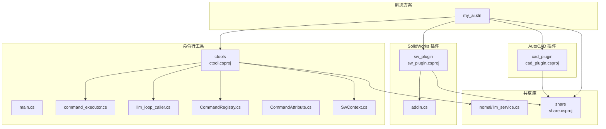
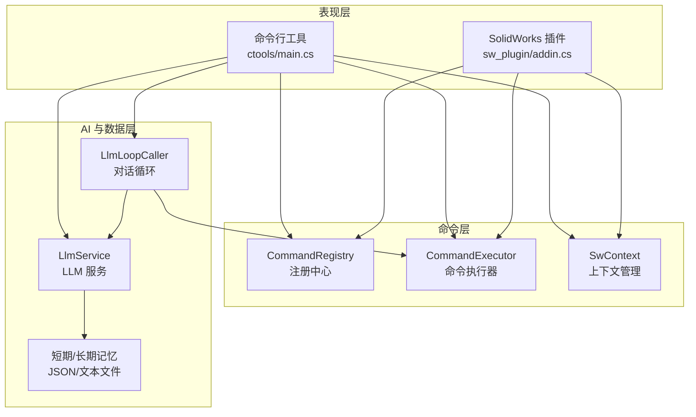
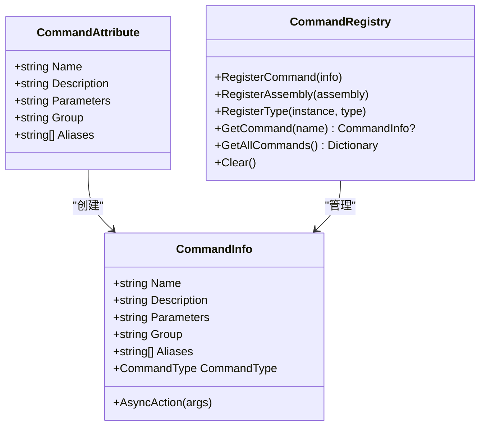
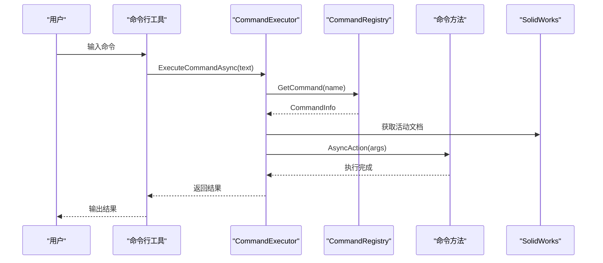
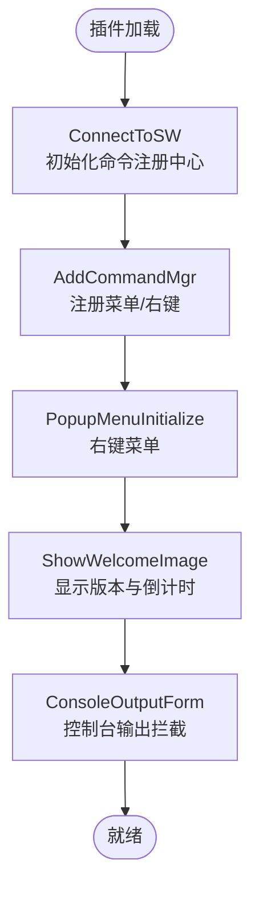
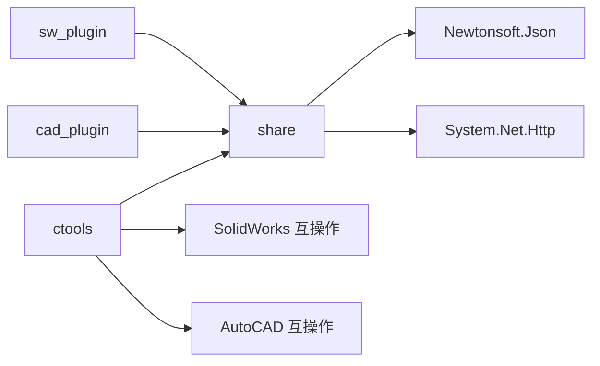

# 项目概述

<cite>
**本文引用的文件**
- [README.md](file://README.md)
- [my_ai.sln](file://my_ai.sln)
- [ctools/main.cs](file://ctools/main.cs)
- [ctools/command_executor.cs](file://ctools/command_executor.cs)
- [ctools/llm_loop_caller.cs](file://ctools/llm_loop_caller.cs)
- [ctools/CommandAttribute.cs](file://ctools/CommandAttribute.cs)
- [ctools/CommandRegistry.cs](file://ctools/CommandRegistry.cs)
- [ctools/SwContext.cs](file://ctools/SwContext.cs)
- [ctools/ctool.csproj](file://ctools/ctool.csproj)
- [sw_plugin/addin.cs](file://sw_plugin/addin.cs)
- [sw_plugin/sw_plugin.csproj](file://sw_plugin/sw_plugin.csproj)
- [cad_plugin/cad_plugin.csproj](file://cad_plugin/cad_plugin.csproj)
- [share/share.csproj](file://share/share.csproj)
- [share/nomal/llm_service.cs](file://share/nomal/llm_service.cs)
</cite>

## 目录
1. [引言](#引言)
2. [项目结构](#项目结构)
3. [核心组件](#核心组件)
4. [架构总览](#架构总览)
5. [详细组件分析](#详细组件分析)
6. [依赖关系分析](#依赖关系分析)
7. [性能考虑](#性能考虑)
8. [故障排除指南](#故障排除指南)
9. [结论](#结论)
10. [附录](#附录)

## 引言
my_ai - SolidWorks 智能助手是一个面向机械工程师的 SolidWorks 二次开发项目，融合了 AI 智能对话、命令行工具与 SolidWorks 插件三大能力，提供从自然语言到自动化命令执行的完整闭环。项目旨在降低设计门槛、提升重复性任务的执行效率，并通过 AI 对话增强人机协作体验。

- 核心价值主张
  - 以自然语言驱动 SolidWorks 操作：用户只需描述需求，AI 即可识别并调用对应命令。
  - 多入口协同：命令行工具、插件界面与右键菜单无缝衔接，满足不同工作场景。
  - 丰富的功能库：覆盖零件、装配体、工程图及 CAD 文件处理，支持批量与高级分析。
  - 智能搜索与确认机制：模糊匹配命令、相似度评分与人工确认，兼顾准确性与安全性。
  - 性能可观测：内置性能分析与控制台输出，便于诊断与优化。

- 目标用户
  - 机械工程师与设计人员：希望快速完成重复性设计任务。
  - SolidWorks 二次开发者：需要统一的命令注册、执行与 AI 集成框架。
  - 教学与研究者：探索 AI 与 CAD 工具链的结合实践。

- 技术优势
  - 统一命令系统：基于特性标记与注册中心，实现命令的声明式注册与动态发现。
  - AI 对话增强：通过 DashScope 通义千问实现 Tool 调用模式，将自然语言映射到具体命令。
  - SolidWorks API 集成：通过 COM 接口与命令管理器，实现菜单、右键菜单与控制台输出的统一接入。
  - 跨平台与跨应用：共享库抽象 CAD/CAx 接口，支持 SolidWorks 与 AutoCAD 的协同。

## 项目结构
项目采用多项目解决方案组织，围绕“命令行工具(ctools)”、“SolidWorks 插件(sw_plugin)”、“AutoCAD 插件(cad_plugin)”与“共享库(share)”四大模块构建，配合统一的命令注册与 AI 服务层。



**图表来源**
- [my_ai.sln:1-43](file://my_ai.sln#L1-L43)
- [ctools/ctool.csproj:1-55](file://ctools/ctool.csproj#L1-L55)
- [sw_plugin/sw_plugin.csproj:1-74](file://sw_plugin/sw_plugin.csproj#L1-L74)
- [cad_plugin/cad_plugin.csproj:1-46](file://cad_plugin/cad_plugin.csproj#L1-L46)
- [share/share.csproj:1-40](file://share/share.csproj#L1-L40)

**章节来源**
- [README.md: 193-249:193-249](file://README.md#L193-L249)
- [my_ai.sln: 1-L43:1-43](file://my_ai.sln#L1-L43)

## 核心组件
- 命令系统与注册中心
  - 命令特性标记：通过特性定义命令名称、描述、参数与分组，支持别名。
  - 注册中心：全局单例，负责命令的注册、别名映射与查询，支持从程序集批量注册。
  - 命令执行器：解析用户输入，解析命令与参数，连接 SolidWorks 实例并执行。
  - 上下文管理：提供全局可访问的 SolidWorks 应用与活动文档实例。

- AI 对话与 Tool 调用
  - LLM 服务：封装 DashScope API，支持普通对话与 VLM 图像分析；内置短期记忆与长期记忆。
  - LLM 循环调用器：将命令注册中心转换为 Tool 定义，实现自然语言到命令的映射与执行；支持用户确认与历史记录。

- SolidWorks 插件
  - 插件主程序：实现 ISwAddin 接口，注册命令管理器、右键菜单与欢迎界面；提供控制台输出窗口。
  - COM 注册：通过 GUID 与注册表项实现插件的自动加载与启用。

- 共享库
  - 抽象 CAD/CAx 接口：统一 AutoCAD 与 SolidWorks 的互操作引用，便于跨应用扩展。
  - 通用工具：包含 LLM 服务、文件遍历、COM 帮助等通用能力。

**章节来源**
- [ctools/CommandAttribute.cs: 1-20:1-20](file://ctools/CommandAttribute.cs#L1-L20)
- [ctools/CommandRegistry.cs: 1-242:1-242](file://ctools/CommandRegistry.cs#L1-L242)
- [ctools/command_executor.cs: 1-116:1-116](file://ctools/command_executor.cs#L1-L116)
- [ctools/SwContext.cs: 1-87:1-87](file://ctools/SwContext.cs#L1-L87)
- [ctools/llm_loop_caller.cs: 1-800:1-800](file://ctools/llm_loop_caller.cs#L1-L800)
- [share/nomal/llm_service.cs: 1-800:1-800](file://share/nomal/llm_service.cs#L1-L800)
- [sw_plugin/addin.cs: 1-339:1-339](file://sw_plugin/addin.cs#L1-L339)

## 架构总览
整体架构由三层组成：表现层（命令行与插件）、命令层（注册中心与执行器）、AI 与数据层（LLM 服务与短期/长期记忆）。命令行工具与插件共享同一套命令系统与 AI 服务，确保行为一致性。



**图表来源**
- [ctools/main.cs: 54-109:54-109](file://ctools/main.cs#L54-L109)
- [ctools/llm_loop_caller.cs: 44-67:44-67](file://ctools/llm_loop_caller.cs#L44-L67)
- [ctools/command_executor.cs: 18-26:18-26](file://ctools/command_executor.cs#L18-L26)
- [share/nomal/llm_service.cs: 32-53:32-53](file://share/nomal/llm_service.cs#L32-L53)

## 详细组件分析

### 命令系统与注册中心
- 设计要点
  - 命令声明式注册：通过特性标记命令元数据，减少样板代码。
  - 注册中心单例：保证跨进程/跨模块的一致性；支持别名映射与批量注册。
  - 类型安全与异步支持：区分同步与异步命令，统一通过委托执行，便于性能统计与异常处理。
  - 反射扫描：自动发现并注册命令，降低维护成本。



**图表来源**
- [ctools/CommandAttribute.cs: 5-18:5-18](file://ctools/CommandAttribute.cs#L5-L18)
- [ctools/CommandRegistry.cs: 12-156:12-156](file://ctools/CommandRegistry.cs#L12-L156)

**章节来源**
- [ctools/CommandAttribute.cs: 1-20:1-20](file://ctools/CommandAttribute.cs#L1-L20)
- [ctools/CommandRegistry.cs: 1-242:1-242](file://ctools/CommandRegistry.cs#L1-L242)

### 命令执行器与上下文管理
- 设计要点
  - 执行器职责：解析命令与参数、连接 SolidWorks、更新当前模型实例、调用命令 Action。
  - 上下文管理：单例持有 SldWorks 与 ModelDoc2，避免重复连接与状态丢失。
  - 错误处理：捕获反射调用异常与通用异常，统一输出错误信息。



**图表来源**
- [ctools/command_executor.cs: 32-113:32-113](file://ctools/command_executor.cs#L32-L113)
- [ctools/CommandRegistry.cs: 113-131:113-131](file://ctools/CommandRegistry.cs#L113-L131)

**章节来源**
- [ctools/command_executor.cs: 1-116:1-116](file://ctools/command_executor.cs#L1-L116)
- [ctools/SwContext.cs: 1-87:1-87](file://ctools/SwContext.cs#L1-L87)

### AI 对话与 Tool 调用流程
- 设计要点
  - Tool 定义构建：将命令注册中心转换为函数工具，支持别名扩展。
  - 模糊匹配与搜索：对用户输入进行相似度评分与关键词匹配，筛选相关命令。
  - 用户确认：在自动模式与确认模式之间切换，保障安全性。
  - 记忆与日志：短期记忆（JSON）与长期记忆（文本）结合，提升上下文连贯性。

```mermaid
sequenceDiagram
participant User as "用户"
participant Loop as "LlmLoopCaller"
participant LLM as "LlmService"
participant Exec as "CommandExecutor"
participant Reg as "CommandRegistry"
User->>Loop : 输入自然语言
Loop->>LLM : ChatWithToolsAsync(prompt, tools)
LLM->>LLM : 搜索相关命令
LLM-->>Loop : (response, toolCalls)
alt 存在工具调用
Loop->>Exec : ExecuteCommandAsync(fullCommand)
Exec->>Reg : GetCommand(name)
Reg-->>Exec : CommandInfo
Exec-->>Loop : 执行结果
Loop->>LLM : 保存工具结果到短期记忆
else 仅文本回复
Loop-->>User : 直接回复
end
```

**图表来源**
- [ctools/llm_loop_caller.cs: 493-726:493-726](file://ctools/llm_loop_caller.cs#L493-L726)
- [share/nomal/llm_service.cs: 547-614:547-614](file://share/nomal/llm_service.cs#L547-L614)

**章节来源**
- [ctools/llm_loop_caller.cs: 1-800:1-800](file://ctools/llm_loop_caller.cs#L1-L800)
- [share/nomal/llm_service.cs: 1-800:1-800](file://share/nomal/llm_service.cs#L1-L800)

### SolidWorks 插件集成
- 设计要点
  - COM 插件：实现 ISwAddin 接口，通过 GUID 与注册表项自动加载。
  - 命令管理器：注册自定义菜单与右键菜单，提供统一入口。
  - 控制台输出：拦截并展示命令执行过程与结果，便于调试。
  - 欢迎界面：显示版本信息与倒计时清空提示，提升用户体验。



**图表来源**
- [sw_plugin/addin.cs: 96-120:96-120](file://sw_plugin/addin.cs#L96-L120)
- [sw_plugin/addin.cs: 114-118:114-118](file://sw_plugin/addin.cs#L114-L118)
- [sw_plugin/addin.cs: 131-210:131-210](file://sw_plugin/addin.cs#L131-L210)

**章节来源**
- [sw_plugin/addin.cs: 1-339:1-339](file://sw_plugin/addin.cs#L1-L339)

## 依赖关系分析
- 项目依赖
  - ctools 依赖 share 共享库，以及 SolidWorks 与 AutoCAD 互操作引用。
  - sw_plugin 与 cad_plugin 均依赖 share，实现跨 CAD 平台能力。
  - LlmService 依赖 Newtonsoft.Json 与 System.Net.Http，提供网络通信与序列化能力。



**图表来源**
- [ctools/ctool.csproj:20-41](file://ctools/ctool.csproj#L20-L41)
- [sw_plugin/sw_plugin.csproj:24-42](file://sw_plugin/sw_plugin.csproj#L24-L42)
- [cad_plugin/cad_plugin.csproj:24-40](file://cad_plugin/cad_plugin.csproj#L24-L40)
- [share/share.csproj:11-30](file://share/share.csproj#L11-L30)

**章节来源**
- [ctools/ctool.csproj: 1-L55:1-55](file://ctools/ctool.csproj#L1-L55)
- [sw_plugin/sw_plugin.csproj: 1-L74:1-74](file://sw_plugin/sw_plugin.csproj#L1-L74)
- [cad_plugin/cad_plugin.csproj: 1-L46:1-46](file://cad_plugin/cad_plugin.csproj#L1-L46)
- [share/share.csproj: 1-L40:1-40](file://share/share.csproj#L1-L40)

## 性能考虑
- 命令执行性能
  - 命令方法可标注性能分析属性，执行后输出耗时统计，便于定位瓶颈。
  - 异步命令与同步命令分离，避免阻塞 UI 或控制台交互。

- AI 调用性能
  - LLM 调用支持流式响应与超时控制，避免长时间等待。
  - 工具过滤：仅向 LLM 传递与用户请求相关的工具，减少上下文大小与推理负担。

- 记忆与日志
  - 短期记忆限制条目数量，防止无限增长；长期记忆按需追加，避免频繁 IO。

**章节来源**
- [ctools/main.cs: 28-32:28-32](file://ctools/main.cs#L28-L32)
- [ctools/main.cs: 209-232:209-232](file://ctools/main.cs#L209-L232)
- [share/nomal/llm_service.cs: 92-114:92-114](file://share/nomal/llm_service.cs#L92-L114)

## 故障排除指南
- 插件注册失败
  - 确保以管理员身份运行注册脚本；检查 DLL 是否存在；确认 SolidWorks 版本兼容性。

- SolidWorks 中找不到插件
  - 重新运行注册脚本；重启 SolidWorks；检查注册表项。

- ctools 无法连接 SolidWorks
  - 先启动 SolidWorks 并确保有激活文档；以管理员身份运行 ctool.exe。

- 命令执行无响应
  - 查看控制台输出；检查 SolidWorks 是否弹出错误；确认当前文档类型符合命令要求。

- AI 对话无法识别命令
  - 使用更明确的命令描述；使用 search 命令查看可用命令；切换到直接命令模式。

**章节来源**
- [README.md: 281-340:281-340](file://README.md#L281-L340)

## 结论
my_ai - SolidWorks 智能助手通过统一的命令系统、AI 对话与 SolidWorks 插件集成，为机械工程师提供了从自然语言到自动化执行的高效工作流。项目具备良好的扩展性与可维护性，既适合初学者快速上手，也为有经验的开发者提供了深入定制的空间。未来可在命令生态完善、AI 模型适配与跨平台兼容方面持续演进。

## 附录
- 快速开始与使用示例
  - 命令行工具：交互式对话模式、直接命令模式、自然语言模式、命令搜索与帮助。
  - 插件：菜单栏、右键菜单、控制台输出与欢迎界面。

- 开发规范
  - 命令命名规范：小写字母与下划线；动词+名词结构；避免大写与中文。
  - 命令特性定义：使用 Command 特性标记命令元数据。

**章节来源**
- [README.md: 143-191:143-191](file://README.md#L143-L191)
- [README.md: 343-371:343-371](file://README.md#L343-L371)